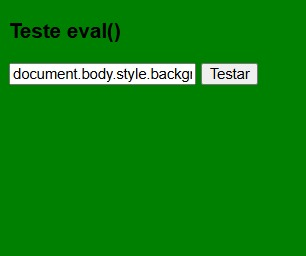

# Teste eval() — Execução de Código Insegura

Projeto simples em HTML com JavaScript embutido para demonstrar os riscos do uso de `eval()`, mostrando como entradas do usuário podem executar código JavaScript diretamente na página.

O projeto executa exatamente o código digitado pelo usuário, evidenciando riscos básicos de segurança quando não há validação.

## Preview



## Funcionalidades

* Campo para digitar código JavaScript.
* Execução direta do código digitado pelo usuário via `eval()`.
* Validação simples de campo vazio.
* Demonstração de como código malicioso pode ser executado.

## Tecnologias

* HTML5
* CSS básico
* JavaScript puro (sem bibliotecas externas)

## Estrutura do Projeto

```
teste-eval/
│
├─ preview.png
└─ index.html
```

## Como usar

Clone o projeto:

```
git clone https://github.com/DevLabatut/teste-eval.git
```

Entre na pasta:

```
cd teste-eval
```

Abra o arquivo no navegador:

```
index.html
```

Digite um código JavaScript e clique em **Testar** para executar.

## Exemplos para teste

Você pode testar entradas como:

```
2+2
```

ou

```
while(true){}
```

ou

```
document.body.style.background="red"
```

para visualizar a execução do código na página.

## Observações de segurança

* Projeto feito apenas para aprendizado.
* Não possui backend ou armazenamento real de dados.
* Nunca utilize `eval()` com dados do usuário em aplicações reais.
* Aplicações reais devem evitar execução dinâmica de código e usar validação adequada.

## Autor

| [<br><sub>DevLabatut</sub>](https://github.com/DevLabatut) |

| :---------------------------------------------------------------------------------------------------------------: |
